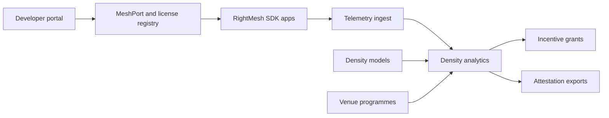

# Denselink

**Source:** `ai-in-decentralized+ai/RightMesh_WP5/`
**Domain:** `ai-decentralized`
**One-liner:** A mesh developer density console for MeshPort allocation, license keys, venue coverage analytics, developer incentive grants, and density modelling — so SDK apps piggyback shared mesh service and reach useful coverage thresholds.
**Wedge:** RightMesh SDK developers and venue operators (stadiums, schools, malls) in emerging-market and event-density contexts where the business whitepaper shows 5% penetration can blanket Dhaka but far higher penetration is needed in San Francisco — starting with the 200+ developer / 80 private-beta project cohort.
**Positioning:** Developer mesh-density ops. The business whitepaper argues connectivity is a human right with ~4B offline; PwC Strategy& cites affordability as the main barrier and that data prices need roughly 90% reduction below 2016 levels for universal affordability (500MB under 5% of monthly income), while 96% of the unconnected live within 2G range. The SDK is the primary product — free with license keys and MeshPort controls so apps share one mesh service. Denselink operationalises density — distinct from Hopsettle (micropayment settlement) and Relaymint (sponsor campaigns).

## Market research synthesis

### Thesis from source

The RightMesh business whitepaper (v5.0 FINAL) opens with net neutrality, individual rights, and technology enabling connectivity for the unconnected. It positions RightMesh as the first P2P network not requiring infrastructure or existing internet connectivity at the local layer, using ad hoc wireless mesh on smartphones with blockchain tokenization (RMESH) aligning incentives among developers, users, gateway operators, and content providers.

On market size and barriers: roughly four billion people remain offline; PwC Strategy& (May 2016) finds affordability is the main adoption barrier and that universal affordability requires data prices to fall about 90% on average versus 2016, defined as 500MB costing less than 5% of monthly income — yet PwC calls universal affordability "challenging" given carrier margin pressure. Critically, 96% of the unconnected are within range of a 2G signal, implying last-mile software mesh can complement rather than replace towers.

The SDK is explicitly the primary product: 200+ developers and 80 projects in private beta compile mesh apps in a few lines of code; the Developer Portal provides free SDK access with license keys required to build, preventing conflicting MeshPorts so one app cannot intercept another's traffic. Apps piggyback a common RightMesh service — Doctor Easy (healthcare messaging density in Bangladesh neighbourhoods) enables later apps like Flare (disaster messaging) to reuse established density. Flare redefines "users" as always-on nodes during disruption to build density; open-source release is planned to spread density globally.

Density modelling is quantitative: Dhaka at 24,700 people/km² reaches useful blanket coverage at 5% RightMesh penetration; San Francisco at 6,632 people/km² needs far higher penetration (modeled ~90.82% for comparable coverage). Target wedges include stadiums, schools, and malls where people congregate; anticipated node range 80–100m. Security uses Open Whisper/Signal E2E encryption (modified for mesh). Network effects explicitly address prior mesh failures due to lack of density — RightMesh uses smartphone and IoT growth as the density engine.

### Buyer & economic model

- **Primary buyer:** VP platform at a RightMesh ecosystem partner or Head of Developer Relations at an organisation standardising on the SDK for offline-first apps.
- **Users:** mobile developers requesting MeshPorts and license keys, venue operators (stadium/school/mall) sponsoring density grants, developer relations managers running incentive programmes, analytics leads reading coverage models, finance approving staking/grant disbursements.
- **Budget owner / value metric:** developer ecosystem and venue partnership budget; value metric is achieved mesh density (% penetration, active nodes/km²) versus model prediction and downstream app retention.
- **Competing status quo:** each app building isolated mesh stacks, hardware mesh deployments, or hoping organic installs reach critical mass without MeshPort coordination or venue wedges.

### Domain constraints

- **Regulatory / trust / safety:** license key enforcement; MeshPort collision prevention; Signal-protocol security expectations; token incentive compliance varies by jurisdiction.
- **Data sensitivity:** density analytics aggregate node presence; developer identities in portal; minimal end-user PII in Denselink.
- **Change-management realities:** SDK is free — revenue is indirect via token/network effects; Denselink must reduce friction for 200+ developer scale while gating ports that could break shared mesh service.

## Business requirements

- BR-1: Every SDK integration must receive a unique MeshPort allocation and license key before production deployment, preventing cross-app traffic interception.
- BR-2: Density models must accept city or venue parameters (population/km², expected range 80–100m) and output penetration targets (e.g., 5% Dhaka vs higher SF).
- BR-3: Developers must see which existing mesh density their app piggybacks, so they choose ports and launch regions informed by Doctor Easy/Flare-style precedents.
- BR-4: Venue wedge programmes (stadium, school, mall) must track active nodes, session duration, and geographic heatmaps for sponsorship reporting.
- BR-5: Incentive grants or staking rewards must tie to measured density milestones, not install counts alone.
- BR-6: Private beta (80 projects) and public beta transitions must enforce license tiers without breaking shared mesh service compatibility.
- BR-7: Flare-style "always-on node" campaigns must be configurable to boost density during disasters without misleading consumer UX metrics.
- BR-8: Coverage gaps flagged when modeled penetration falls below useful blanket threshold for a launch city.
- BR-9: MeshPort conflict detection must block publication when a port collides with an existing licensed app.
- BR-10: Developer portal exports must list SDK version, MeshPort, and density contribution rank for ecosystem governance.
- BR-11: Affordability narrative (90% price drop goal) must appear in venue ROI reports as contextual benchmark, not as guaranteed outcome.
- BR-12: E2E encryption (Signal-derived) status must be attestable per app build linked to license key.

## User stories

Canonical user stories live in sibling [USER_STORIES.md](USER_STORIES.md).

## System design

### Overview

Denselink is the developer and venue control plane for RightMesh density. It issues license keys and MeshPorts, models coverage for cities and venues, ingests anonymised node telemetry to compute penetration and heatmaps, and runs grant/staking programmes tied to milestones. It feeds Relaymint attestation and informs Hopsettle operators where economic activity should concentrate — but does not implement mesh transport or payments itself.

### Actors & boundaries

- **Actors:** SDK developer, DevRel manager, venue operator, analytics lead, incentives admin, platform admin; RightMesh SDK/runtime as external system.
- **Trust boundary:** Denselink stores developer accounts, license metadata, aggregated density — not message payloads protected by Signal E2E.
- **Human-in-the-loop points:** grant approval; license revocation; venue programme design; model parameter overrides for atypical geographies.

### Core capabilities

1. **MeshPort and license registry** — allocation, collision detection, revocation.
2. **Density modelling** — city and venue penetration calculators (Dhaka 5% vs SF benchmarks).
3. **Telemetry analytics** — active nodes, heatmaps, session metrics.
4. **Piggyback discovery** — which apps contribute density in a region.
5. **Incentive and grant programmes** — milestone-linked staking/grants.
6. **Venue wedge kits** — stadium/school/mall templates.
7. **Developer portal reporting** — SDK version, contribution ranks, beta cohort status.

### Conceptual data

- **Primary entities:** DeveloperAccount, LicenseKey, MeshPort, AppRegistration, DensityModel, VenueProgramme, NodeTelemetryAggregate, GrantProgramme, Milestone, CoverageHeatmap, EncryptionAttestation.
- **Critical events:** license issued, meshport allocated, node telemetry ingested, milestone achieved, grant disbursed, license revoked, collision blocked.
- **Retention / audit needs:** license and grant records for partner audit; telemetry aggregates with short raw retention.

### Integrations (conceptual)

- **Systems of record:** RightMesh Developer Portal/SDK, optional RMESH staking contracts, venue ticketing/footfall for correlation.
- **Upstream signals:** anonymised node heartbeats, app version/beacon, geographic bins, disaster mode flags from Flare-like apps.
- **Downstream actions:** license/API key issuance, grant payouts, Relaymint coverage feeds, developer notifications on density gaps.

### High-level architecture

### Success metrics

- **Leading:** licensed apps active per city; MeshPort collision rate (target zero); model vs actual penetration variance; grant milestone hit rate.
- **Lagging:** useful blanket coverage days per venue; developer retention in 200+ cohort; piggyback launch success rate; offline app session completion vs non-mesh baseline; progress toward affordability narrative via effective cost per MB proxy metrics.

## OpenAPI skeleton

Canonical HTTP surface lives in sibling [openapi.yaml](openapi.yaml). Summary:

- **Base path:** `/v1/...`
- **Auth:** `X-API-Key` for SDK telemetry and license verification; Bearer JWT for DevRel and venue consoles.
- **Resource groups:** MeshPorts, Licenses, DensityModels, Grants, Venues, Reporting.
