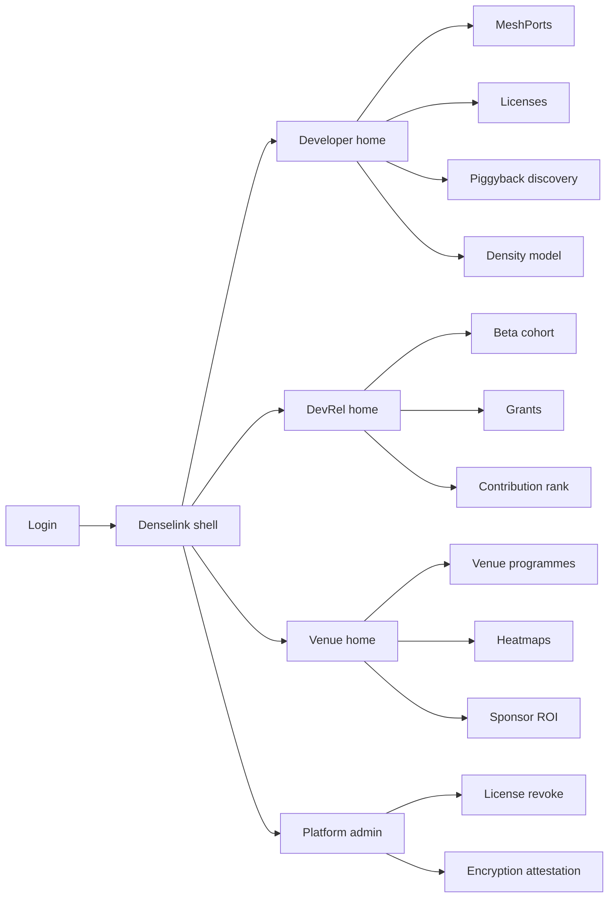
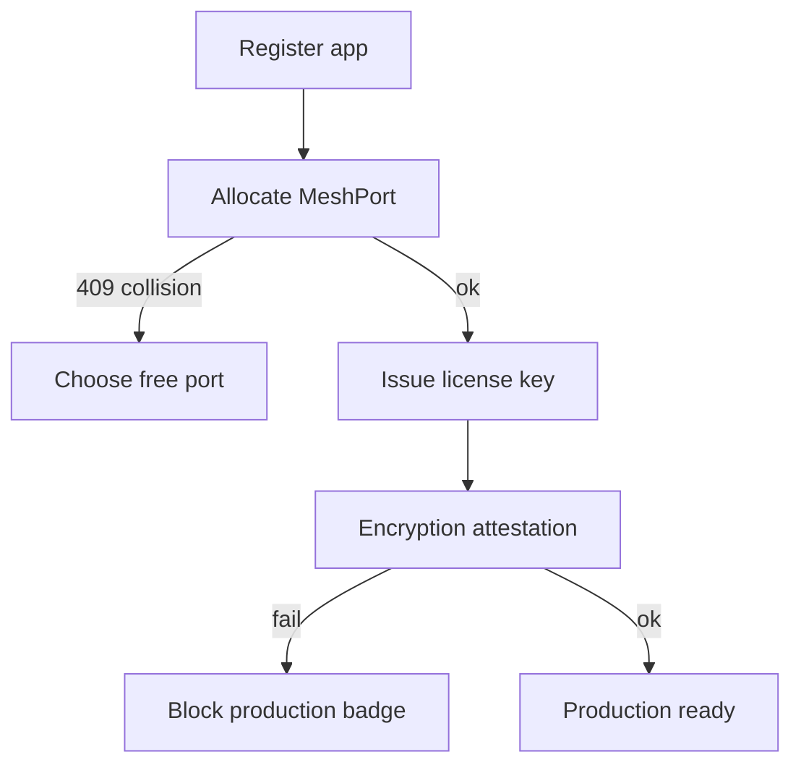
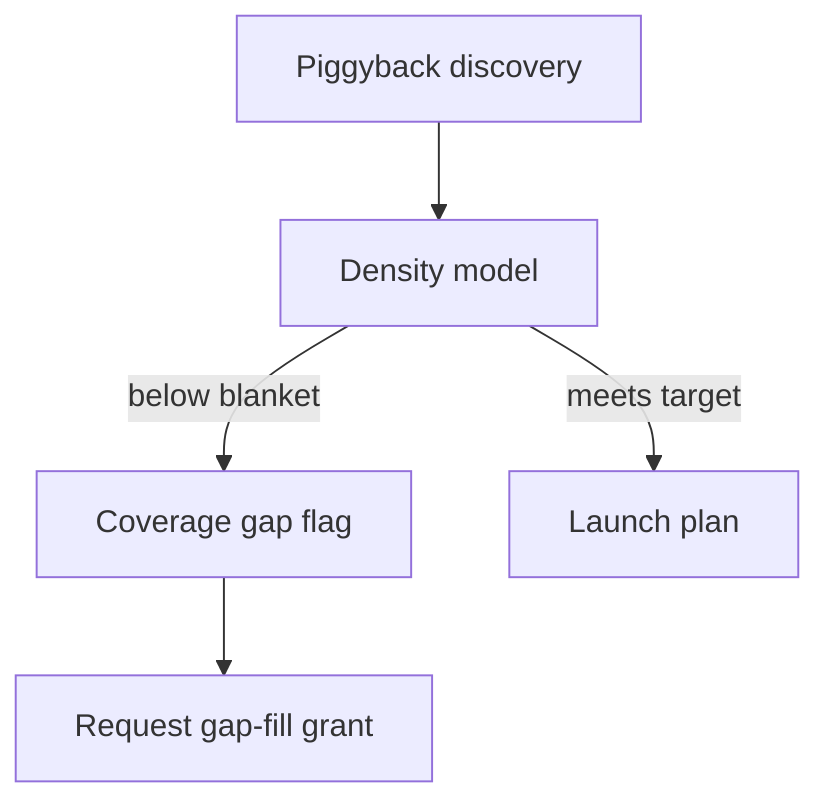

# Denselink — Web app

**Product:** [PRODUCT.md](./PRODUCT.md)
**Primary surface:** Mesh developer density console (SDK portal + DevRel + venue programmes under one Denselink shell)
**Secondary surfaces:** Venue event-day coverage board (read-mostly for sponsors); grant milestone attestation export; encryption attestation status page per build
**Design thesis:** Denselink is a coverage commons desk, not a “token ecosystem dashboard.” The metaphor is a city-planning density map crossed with a port registry: every app must earn a unique MeshPort and license before it can piggyback the shared mesh service, and every launch city must show whether 5%-Dhaka or ~90%-SF penetration math applies. Visual language is warm concrete and coverage-teal on dusk charcoal — heatmaps feel cartographic, not casino. The Denselink wordmark sits as a surveyor’s mark on every density-bearing screen so developers and venue sponsors share one truth about whether the mesh is actually useful yet.

## UX research synthesis

### Category peers (best-in-class)

- **Twilio Console (phone numbers / messaging services):** Instant credential issuance, collision-safe resource ids, clear “what this key can do.” Steal: MeshPort + license issued in minutes with collision 409 as a first-class UX; reject Twilio’s product sprawl nav that would bury density models.
- **Firebase / Google Cloud API key & app registration:** Per-app keys, SHA/build binding, revoke flows. Steal: license tied to app build + encryption attestation; reject generic cloud IAM density as the home metaphor.
- **Helium Console / Coverage maps:** Geographic hex/heatmap of useful coverage vs dead zones. Steal: 80–100m granularity heatmaps and gap flags; reject consumer hotspot mining leaderboards.
- **Apple Developer / Play Console cohort tools:** Beta cohorts, license tiers, revoke on abuse. Steal: private-beta (80 projects) gating without breaking shared service; reject store-review aesthetics for mesh density ops.

### Patterns to adopt / reject

- **Adopt:** MeshPort allocation with hard collision block; piggyback discovery (“Doctor Easy density here — launch Flare-class app”); city model calculator (pop/km² → penetration target); venue wedge kits (stadium/school/mall); grants on density milestones not vanity installs; always-on-node campaign flags that do not inflate consumer UX metrics; coverage-gap banners below useful blanket threshold.
- **Reject:** RMESH price charts as home; install-count vanity KPIs as grant triggers; purple “AI coverage insights”; editable heatmaps; treating affordability 90% narrative as a guaranteed SLA; one shared MeshPort for all apps.

### Trust, density, and workflow constraints from PRODUCT.md

SDK is free but ports must not collide (BR-1, BR-9) — publication blocks on conflict. Density models must be city/venue-parameterised with realistic Dhaka vs SF targets (BR-2, BR-8). Developers need piggyback visibility before regional launch (BR-3). Venue programmes need event-day nodes, sessions, heatmaps for sponsors (BR-4). Grants tie to measured density milestones (BR-5). Beta tiers must not break shared mesh compatibility (BR-6). Flare-style always-on campaigns are configurable without misleading consumer metrics (BR-7). Affordability narrative is contextual in ROI reports only (BR-11). Signal-derived E2E attestation per build is mandatory trust chrome (BR-12).

## Information architecture

### Nav model

### Roles → default home

| Role | Default home | Why |
|------|--------------|-----|
| Mobile developer | Developer home — ports + piggyback | Ship without forking shared service (BR-1, BR-3) |
| DevRel manager | Contribution rank + grants | Density commons funding (BR-5, BR-10) |
| Venue operator | Venue programme event board | Sponsor-ready coverage (BR-4) |
| Analytics lead | Density model + heatmaps | Realistic penetration (BR-2, BR-8) |
| Incentives admin | Grant milestones | Disburse on density not installs (BR-5) |
| Platform administrator | Revoke + attestation queue | Abuse and E2E promises (BR-9, BR-12) |

### Cross-links to OpenAPI resources

| Nav area | OpenAPI tags / resources |
|----------|---------------------------|
| MeshPort allocation / collisions | MeshPorts |
| License keys / build bind | Licenses |
| City/venue penetration models | DensityModels |
| Milestone grants | Grants |
| Stadium/school/mall programmes | Venues |
| Contribution / coverage exports | Reporting |

## Screen inventory

### Developer home

- **Purpose:** Answer “do I have a valid MeshPort + license, and where can I piggyback useful density today?”
- **Entry:** Post-login for SDK developers.
- **Layout regions:** Brand + app switcher; license/port status strip; piggyback region cards (existing density contributors); coverage-gap alerts for chosen launch city; CTA to allocate port or open model.
- **Primary actions:** Allocate MeshPort; issue/renew license; open piggyback map; run density model.
- **Empty / loading / error:** Empty = guided “register first app + allocate port”; error = collision or attestation fail with next steps.
- **BR / story ties:** BR-1, BR-3, BR-8; developer stories.

### MeshPort registry

- **Purpose:** Allocate unique ports and block publication on collision so one app cannot intercept another’s traffic.
- **Entry:** Developer nav; admin search.
- **Layout regions:** Port table (app, port, status, SDK version); allocate form; collision detail when 409; revoke history link.
- **Primary actions:** Allocate; request change; view conflicting app (metadata only).
- **Empty / loading / error:** Collision = blocking banner naming conflict class; cannot force-publish.
- **BR / story ties:** BR-1, BR-9; admin abuse story.

### License keys and build bind

- **Purpose:** Issue free SDK license keys required to build; bind to app and encryption attestation.
- **Entry:** Developer home; Licenses nav.
- **Layout regions:** Key list (tier: private/public beta); create key; build attestation status (Signal-derived E2E); copy-once secret panel; revoke control (admin).
- **Primary actions:** Issue key; rotate; download attestation report; revoke (admin).
- **Empty / loading / error:** Attestation fail = negative-path alert, block “production ready” badge.
- **BR / story ties:** BR-1, BR-6, BR-12.

### Piggyback discovery

- **Purpose:** Show which licensed apps already contribute density in a region so launches follow Doctor Easy → Flare logic.
- **Entry:** Developer home; regional launch planner.
- **Layout regions:** Region selector; contributor list (rank, node density, always-on campaign flags); suggested wedge venues; launch readiness score vs model.
- **Primary actions:** Shortlist region; open venue kit; export contribution context.
- **Empty / loading / error:** Empty region = “greenfield — model will show high penetration need.”
- **BR / story ties:** BR-3, BR-7; developer and DevRel stories.

### Density model calculator

- **Purpose:** Accept city/venue parameters and output penetration targets (e.g. Dhaka ~5% vs SF much higher).
- **Entry:** Analytics default; developer launch planner.
- **Layout regions:** Inputs (pop/km², node range 80–100m, venue footprint); benchmark presets (Dhaka, San Francisco); output (target penetration, estimated nodes); gap flag if plan below useful blanket.
- **Primary actions:** Save model scenario; compare cities; push target to grant programme.
- **Empty / loading / error:** Invalid range = inline validation; override atypical geography requires reason.
- **BR / story ties:** BR-2, BR-8; analytics lead stories.

### Venue programme board

- **Purpose:** Run stadium/school/mall wedges with active nodes, session duration, and geographic heatmaps for sponsors.
- **Entry:** Venue operator home; DevRel venue list.
- **Layout regions:** Programme header (venue type kit); event-day KPI strip; heatmap (80–100m bins); session table; playbook steps for school IT / stadium ops.
- **Primary actions:** Start event window; export sponsor pack; flag dead zones for gap-fill grants.
- **Empty / loading / error:** Pre-event empty = checklist to enroll devices; telemetry lag watermark.
- **BR / story ties:** BR-4; venue operator stories.
- **Mobile notes:** Event-day board single-column; large heatmap with pan/zoom.

### Always-on node campaigns

- **Purpose:** Configure Flare-style disaster density boosts without misleading consumer UX metrics.
- **Entry:** App settings; DevRel campaign tools.
- **Layout regions:** Campaign toggle; density-only metric definition; consumer-metric exclusion notice; region scope; end criteria.
- **Primary actions:** Enable campaign; attest metric separation; notify venue partners.
- **Empty / loading / error:** Warn if consumer dashboards would double-count nodes.
- **BR / story ties:** BR-7.

### Grants and milestones

- **Purpose:** Release incentive grants/staking rewards on measured density milestones, not install counts alone.
- **Entry:** DevRel / incentives admin.
- **Layout regions:** Programme list; milestone definitions (nodes/km², useful blanket days); project progress; approval queue; disbursement log.
- **Primary actions:** Approve milestone; reject with reason; export attestation for treasury.
- **Empty / loading / error:** Block create if milestone uses installs-only metric.
- **BR / story ties:** BR-5; finance/incentives stories.

### Contribution rank and beta cohort

- **Purpose:** Rank projects by density contribution; manage private-beta (~80) → public beta without breaking shared mesh compatibility.
- **Entry:** DevRel home.
- **Layout regions:** Rank table (SDK version, MeshPort, density contribution); cohort filters; tier transition checklist; governance export.
- **Primary actions:** Promote tier; request port audit; export portal report.
- **Empty / loading / error:** Cohort risk if collision rate &gt; 0 shown as blocker to public beta.
- **BR / story ties:** BR-6, BR-10.

### Sponsor ROI report

- **Purpose:** Venue ROI with affordability narrative as contextual benchmark only (not a guarantee).
- **Entry:** Venue programme → ROI; finance.
- **Layout regions:** Coverage achieved vs model; session completion vs non-mesh baseline; affordability footnote (90% price-drop goal as context); export PDF.
- **Primary actions:** Generate sponsor pack; disclaimer lock on affordability wording.
- **Empty / loading / error:** Insufficient telemetry = draft watermark.
- **BR / story ties:** BR-11, BR-4.

### License revoke and attestation admin

- **Purpose:** Revoke abusive keys; alert when encryption attestation fails for a build.
- **Entry:** Platform admin default.
- **Layout regions:** Abuse queue; revoke form with MeshPort impact; attestation failure list; notify developer.
- **Primary actions:** Revoke; reinstate with audit; force re-attest.
- **Empty / loading / error:** Empty = healthy “no attestation failures.”
- **BR / story ties:** BR-9, BR-12; admin stories.

## Key flows

1. **Ship first mesh app** — register app → allocate MeshPort → issue license → attest E2E → production-ready; failure: port collision or attestation fail blocks publish.

2. **Choose launch region** — open piggyback discovery → compare density contributors → run city model → accept or reject launch given gap flag.

3. **Venue event day** — enrol programme → open event window → monitor heatmap/sessions → export sponsor pack; failure: telemetry lag → delayed board with watermark.

4. **Milestone grant** — density milestone hit → admin review → disburse; failure: installs-only evidence rejected (BR-5).

5. **Abuse revoke** — detect MeshPort abuse → revoke license → notify → ports freed from collision set.

## Design system

### Tokens (CSS variables)

- `--color-ink: #E8E4DC` — primary text on dusk ground
- `--color-dusk-950: #12100E` — app ground
- `--color-dusk-900: #1C1916` — panels
- `--color-concrete: #8A847A` — secondary labels / map grid
- `--color-coverage: #2A9B8F` — useful blanket / healthy density (teal)
- `--color-coverage-hot: #3CB8A8` — heatmap high bins
- `--color-gap: #C45C26` — coverage gap / below threshold
- `--color-collision: #C53D3D` — MeshPort conflict
- `--color-brand: #D4C4A8` — Denselink surveyor mark
- `--font-display: "Outfit", sans-serif` — titles and density numerals
- `--font-body: "Source Sans 3", sans-serif` — forms and tables
- `--font-mono: "IBM Plex Mono", monospace` — MeshPorts, license ids, hashes
- `--space-1`…`--space-8`: 4px scale
- `--radius-sm: 4px`; `--radius-md: 8px` — cartographic sharp, not pill UI
- `--motion-heat: 280ms ease-in-out` — heatmap bin fade-in
- `--motion-gap: 220ms ease-in-out` — gap banner pulse
- `--motion-stamp: 160ms ease-out` — port allocate confirm
- Atmosphere: subtle topographic contour lines in dusk-900; warm concrete dust; no neon token-glow or purple mesh blobs.

### Typography & brand

- Outfit for coverage numerals and screen titles; Source Sans for dense tables; mono for ports and keys.
- Denselink wordmark left of chrome on every density/license view — never replaced by generic “Dashboard.”
- Login shell: brand as hero; one headline (“Density before launch”); one CTA — no affordability stat strip as fake SLA.

### Do / don’t

- **Do:** Block on MeshPort collision; show Dhaka vs SF model honesty; grant on density milestones; separate always-on campaign metrics from consumer UX; attest E2E per build.
- **Don’t:** Purple Web3 glow; install vanity as primary KPI; editable heatmaps; guarantee 90% price drop; shared ports; emoji “connected humanity” chrome.

### Accessibility & domain trust cues

- Contrast AA+ for coverage teal and gap orange on dusk; gap state also in text (“Below useful blanket”).
- Live regions announce collision blocks and attestation failures.
- Focus order: port → license → model → venue → grant.
- Sponsor exports include fixed affordability disclaimer language (BR-11).

## Component patterns

- **MeshPortAllocateForm** — allocate with live collision check and 409 panel.
- **LicenseAttestationBadge** — E2E status bound to build + key.
- **PiggybackRegionCard** — contributor density summary for a launch region.
- **DensityModelPanel** — pop/km² + range → penetration target with Dhaka/SF presets.
- **CoverageHeatmap** — 80–100m bins with gap highlighting.
- **VenueWedgeKit** — stadium/school/mall playbook + event window.
- **MilestoneGrantRow** — density criterion, progress, disburse action.
- **AlwaysOnCampaignFlag** — density-boost mode with consumer-metric exclusion.
- **ContributionRankTable** — SDK version, port, density rank for governance export.

## Out of scope for v1 web

- Implementing RightMesh transport or smartphone radio stack; Hopsettle micropayment channel ops; Relaymint sponsor campaign marketplace; custodial RMESH wallet; end-user messaging UI (Doctor Easy/Flare clients); hardware mesh AP provisioning; native mobile DevRel apps.
